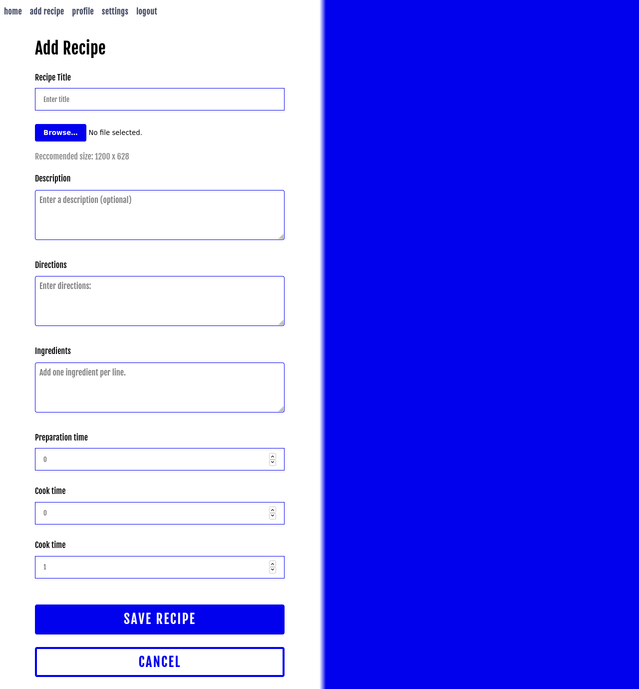
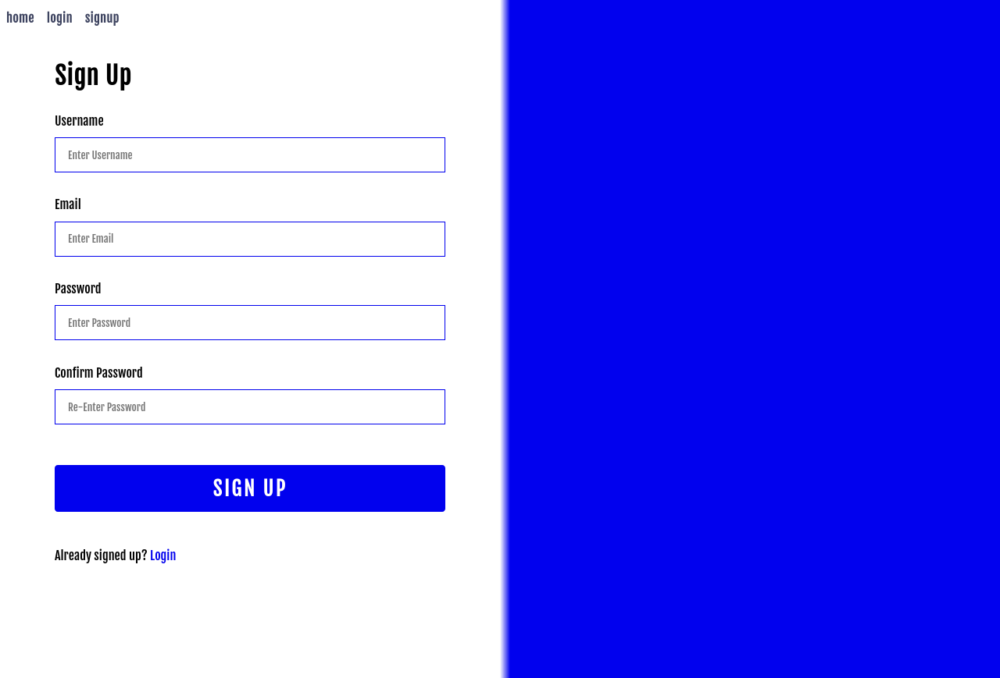

# Nodejs, Express, Mongo, Passportjs





```

├── authentication/
│   ├── authentication.js
│   ├── notauthenticated.js
│   └── passport.js
├── models/
│   └── user.js
├── public/
│   ├── css/
│   │   └── style.css
│   ├── fonts/
│   │   ├── FjallaOne-Regular.eot
│   │   ├── FjallaOne-Regular.otf
│   │   ├── FjallaOne-Regular.ttf
│   │   ├── FjallaOne-Regular.woff
│   │   └── FjallaOne-Regular.woff2
│   ├── images/
│   │   ├── polka-dots-938427_1280_wave.jpg
│   │   └── screenshot1.png
│   ├── js/
│   │   └── script.js
│   └── favicon.ico
├── routes/
│   ├── index.js
│   ├── profile.js
│   └── users.js
├── views/
│   ├── index.pug
│   ├── layout.pug
│   ├── login.pug
│   ├── profile.pug
│   ├── recipe.pug
│   ├── settings.pug
│   └── signup.pug
├── application.js
├── LICENSE
├── package.json
├── package-lock.json
└── readme.md

```
